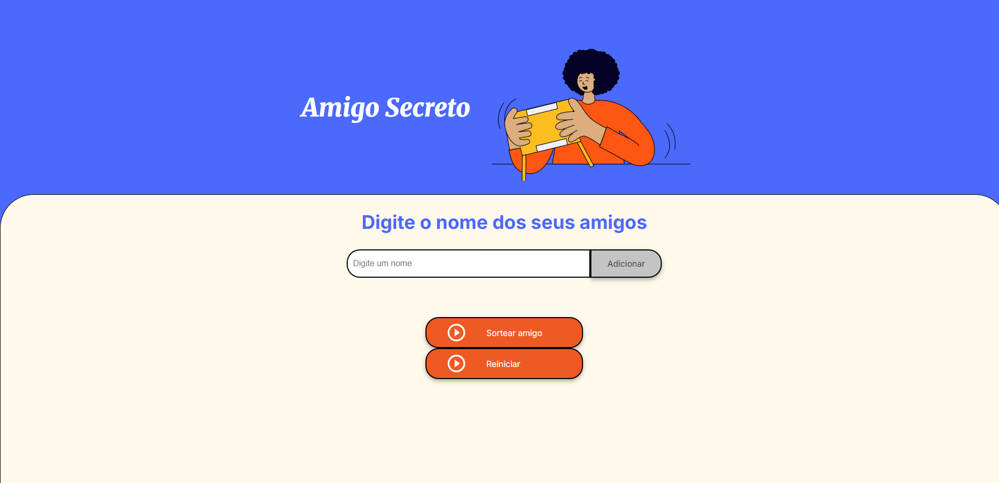

# Jogo do Amigo secreto

> ONE - Oracle Next Education

Projeto construído através do curso de lógica de programação com JavaScript da Oracle Next Education.

[🔗 Clique aqui para acessar](https://amigo-secreto-git-main-ryderxzs-projects.vercel.app/
)
##  💻 Tecnologias

- JavaScript
- HTML
- CSS
- Git e Github

## 📚 Como funciona o jogo:

- Digite o nome dos seus amigos e depois click em adicionar.
- Quando todos os nomes estiverem digitados, você pode sortear algum dos amigos clicando no botão "Sortear Amigo".
- Você também pode reiniciar o jogo clicando no botão "Reiniciar".

## 📞 Contato

- E-mail: victorgideao01@gmail.com
- [Linkedin](https://www.linkedin.com/in/gideão-victor)